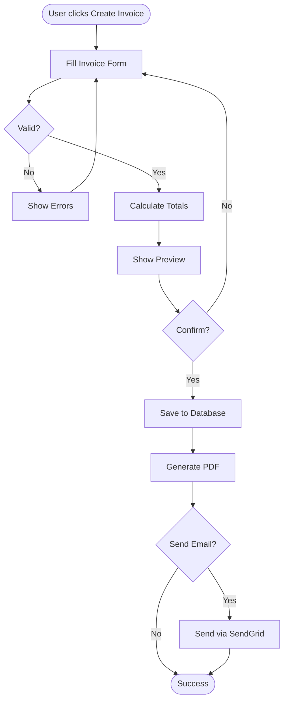
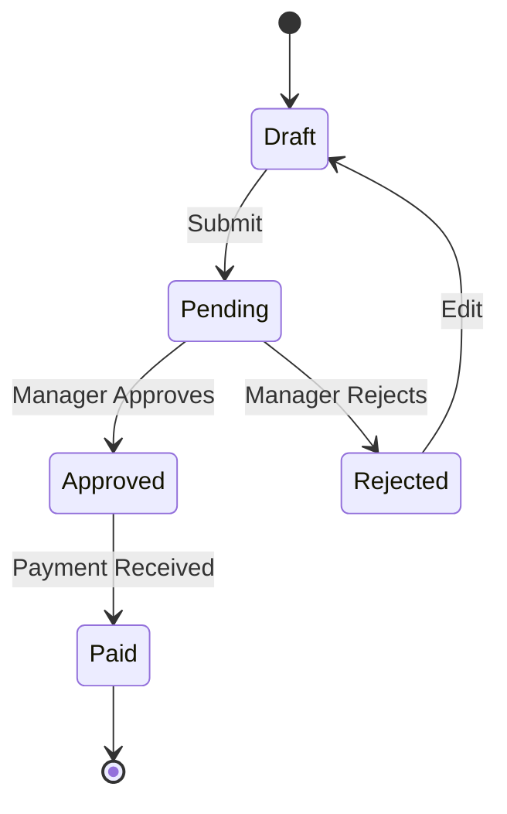
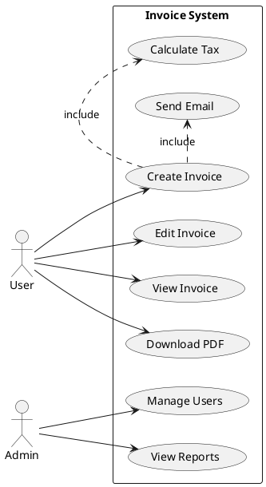
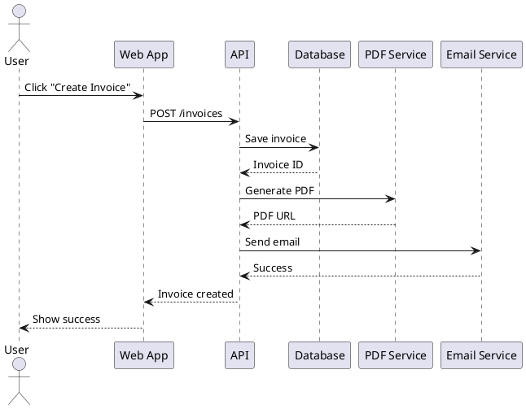
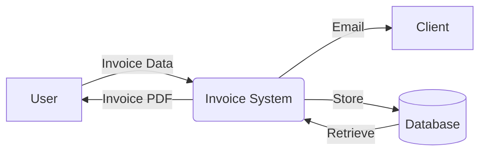

# Process Modeling với BPMN

## BPMN Diagrams

### Invoice Creation Flow


### Approval Workflow


## Use Case Diagram (PlantUML)



## Sequence Diagram



## Swimlane Diagram

```markdown
┌─────────────────────────────────────────────────────┐
│ Invoice Approval Process                            │
├──────────┬──────────────┬──────────────┬───────────┤
│ User     │ Manager      │ Finance      │ System    │
├──────────┼──────────────┼──────────────┼───────────┤
│ Create   │              │              │           │
│ Invoice  │              │              │           │
│    │     │              │              │           │
│    ▼     │              │              │           │
│ Submit ──┼─► Review     │              │           │
│          │     │        │              │           │
│          │     ▼        │              │           │
│          │  Approve? ───┼─► Process    │           │
│          │     │        │     │        │           │
│          │     │        │     ▼        │           │
│          │     │        │  Record ─────┼─► Update  │
│          │     │        │              │   Status  │
│          │     ▼        │              │     │     │
│      ◄───┼── Notify     │              │     │     │
│  Receive │              │              │     │     │
│  Email   │              │              │     ▼     │
│          │              │              │   Done    │
└──────────┴──────────────┴──────────────┴───────────┘
```

## Data Flow Diagram (Level 0)



## Tools

- **Mermaid.js** - Diagrams in markdown
- **PlantUML** - UML diagrams
- **Lucidchart** - Online diagramming
- **Draw.io** - Free, open-source

---

<p><a href="./03-solution-design-document.md">← Solution Design Document</a> | <a href="./README.md">Về Trang chủ →</a></p>
