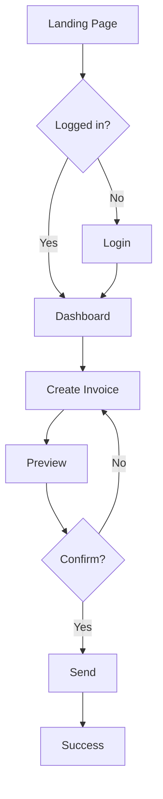

# PRD - Product Requirements Document

## PRD là gì?

**Product Requirements Document (PRD)** là tài liệu chi tiết mô tả:
- **What** to build (tính năng gì)
- **Why** build it (lý do, business value)
- **Who** it's for (target users)
- **How** it should work (user flows, specs)

## PRD Template

```markdown
# [Feature Name]

## 1. Overview
- **Author:** [PM Name]
- **Date:** [YYYY-MM-DD]
- **Status:** Draft | Review | Approved
- **Stakeholders:** [Engineering, Design, Business]

## 2. Problem Statement
[What problem are we solving? User pain point?]

Example:
"Users spend 5+ minutes manually creating invoices, leading to errors
and delays in payment processing."

## 3. Goals & Success Metrics

### Business Goals
- Increase revenue by X%
- Reduce churn by Y%
- Expand to new market segment

### User Goals
- Complete task faster
- Reduce errors
- Better user experience

### Success Metrics
| Metric | Current | Target | Measurement |
|--------|---------|--------|-------------|
| Task completion time | 5 min | 2 min | Analytics |
| Error rate | 15% | <5% | Support tickets |
| NPS | 30 | 50 | Survey |

## 4. User Stories

### Primary User Story
**As a** [user role]
**I want to** [action]
**So that** [benefit]

**Acceptance Criteria:**
- [ ] Criterion 1
- [ ] Criterion 2
- [ ] Criterion 3

### Edge Cases
- What if user has no data?
- What if API fails?
- What if user is offline?

## 5. User Experience

### User Flow


### Wireframes
[Link to Figma/Sketch designs]

### Key Interactions
1. **Creating invoice**
   - Click "New Invoice"
   - Fill form (auto-complete for clients)
   - Add line items (drag-and-drop)
   - Preview PDF
   - Send via email

2. **Editing invoice**
   - Click existing invoice
   - Inline editing
   - Auto-save draft
   - Track changes

## 6. Functional Requirements

### FR-001: Invoice Creation
**Description:** User can create a new invoice from template

**Input:**
- Client details (autocomplete from existing)
- Line items (product, qty, price)
- Tax rate (auto-calculated)
- Payment terms (dropdown)

**Process:**
1. Validate all required fields
2. Calculate totals (subtotal, tax, total)
3. Generate unique invoice number
4. Create PDF preview

**Output:**
- Invoice saved to database
- PDF generated
- Email sent to client (optional)

**Business Rules:**
- Invoice number format: `INV-YYYY-MMDD-XXX`
- Tax rate based on client location
- Payment terms: Net 15, 30, 60 days

**Example:**
```json
{
  "invoiceNumber": "INV-2026-0211-001",
  "clientId": "CLT-123",
  "items": [
    {
      "description": "Web Development",
      "quantity": 40,
      "unitPrice": 100,
      "amount": 4000
    }
  ],
  "subtotal": 4000,
  "taxRate": 0.10,
  "tax": 400,
  "total": 4400,
  "paymentTerms": "Net 30",
  "dueDate": "2026-03-13"
}
```

### FR-002: Auto-save Draft
**Description:** System auto-saves invoice every 30 seconds

**Trigger:** User makes changes
**Frequency:** Every 30 seconds
**Storage:** Browser localStorage + backend
**Restoration:** On page reload or crash recovery

## 7. Non-Functional Requirements

### Performance
- Page load < 2 seconds
- Invoice generation < 1 second
- PDF creation < 3 seconds
- Support 1000 concurrent users

### Security
- HTTPS only
- Authentication required
- Role-based access control
- Data encryption at rest

### Scalability
- Handle 100K invoices/month
- Database indexing on invoice number
- CDN for PDF storage

### Accessibility
- WCAG 2.1 AA compliant
- Keyboard navigation
- Screen reader compatible
- High contrast mode

## 8. Technical Considerations

### API Endpoints
```javascript
// Create invoice
POST /api/invoices
Body: { clientId, items[], taxRate, paymentTerms }
Response: { invoiceId, invoiceNumber, pdfUrl }

// Get invoice
GET /api/invoices/:id
Response: { invoice details }

// Update invoice
PUT /api/invoices/:id
Body: { updated fields }

// Delete invoice
DELETE /api/invoices/:id
```

### Database Schema
```sql
CREATE TABLE invoices (
  id SERIAL PRIMARY KEY,
  invoice_number VARCHAR(20) UNIQUE NOT NULL,
  client_id INTEGER REFERENCES clients(id),
  subtotal DECIMAL(10,2) NOT NULL,
  tax_rate DECIMAL(4,2) NOT NULL,
  tax DECIMAL(10,2) NOT NULL,
  total DECIMAL(10,2) NOT NULL,
  payment_terms VARCHAR(20),
  due_date DATE,
  status VARCHAR(20) DEFAULT 'draft',
  created_at TIMESTAMP DEFAULT NOW(),
  updated_at TIMESTAMP DEFAULT NOW()
);

CREATE TABLE invoice_items (
  id SERIAL PRIMARY KEY,
  invoice_id INTEGER REFERENCES invoices(id),
  description TEXT NOT NULL,
  quantity DECIMAL(10,2) NOT NULL,
  unit_price DECIMAL(10,2) NOT NULL,
  amount DECIMAL(10,2) NOT NULL
);
```

### Integration Points
- **Email Service:** SendGrid for invoice delivery
- **PDF Generator:** PDFKit or Puppeteer
- **Payment Gateway:** Stripe for online payments
- **Analytics:** Mixpanel for user behavior tracking

## 9. Dependencies & Risks

### Dependencies
- Design team: Wireframes by Feb 15
- Backend team: API endpoints by Feb 20
- Legal team: Terms & conditions approval

### Risks
| Risk | Impact | Probability | Mitigation |
|------|--------|-------------|------------|
| PDF generation slow | High | Medium | Use background jobs, caching |
| Email delivery fails | Medium | Low | Retry logic, manual download option |
| Tax calculation errors | High | Low | Extensive testing, audit trail |

## 10. Launch Plan

### Phase 1: MVP (Week 1-2)
- Basic invoice creation
- PDF generation
- Email sending

### Phase 2: Enhancements (Week 3-4)
- Templates
- Recurring invoices
- Payment tracking

### Phase 3: Advanced (Week 5+)
- Multi-currency
- Batch operations
- Advanced reporting

### Rollout Strategy
1. Internal testing (50 invoices)
2. Beta users (10 customers)
3. Gradual rollout (10% → 50% → 100%)

## 11. Out of Scope
- Mobile app (future phase)
- Multi-language support (future phase)
- Advanced tax rules (future phase)
- Integration with accounting software (future phase)

## 12. Open Questions
- [ ] Should we support multiple tax rates per invoice?
- [ ] What's the max number of line items?
- [ ] Do we need approval workflow?
- [ ] How long to keep deleted invoices?

## 13. Appendix

### Competitive Analysis
| Competitor | Feature | Our Approach |
|------------|---------|--------------|
| FreshBooks | Simple UI | Similar, but faster |
| QuickBooks | Full accounting | Focus on invoicing only |
| Wave | Free tier | Freemium model |

### User Research Insights
- 80% of users create <5 invoices/month
- 60% want mobile access
- 40% need recurring invoices
- Top complaint: "Too slow to create"
```

---

## PRD Best Practices

✅ **Start with WHY** - Problem statement first
✅ **Quantify success** - Metrics, not vague goals
✅ **Be specific** - Clear acceptance criteria
✅ **Include examples** - JSON, SQL, code snippets
✅ **Visual aids** - Diagrams, wireframes
✅ **Think edge cases** - What can go wrong?
✅ **Scope clearly** - In scope vs out of scope
✅ **Collaborate** - Review with eng, design, business

❌ **Don't** be vague - "Should be fast, easy"
❌ **Don't** skip metrics - How measure success?
❌ **Don't** over-specify UI - That's design's job
❌ **Don't** forget edge cases - Happy path only

---

## PRD Tools

- **Notion** - Collaborative docs
- **Confluence** - Wiki-style
- **Google Docs** - Simple, shareable
- **ProductBoard** - Feature prioritization
- **Aha!** - Roadmap + PRD

---

<p><a href="./02-product-discovery.md">← Product Discovery</a> | <a href="./04-metrics-and-analytics.md">Tiếp: Metrics & Analytics →</a></p>
