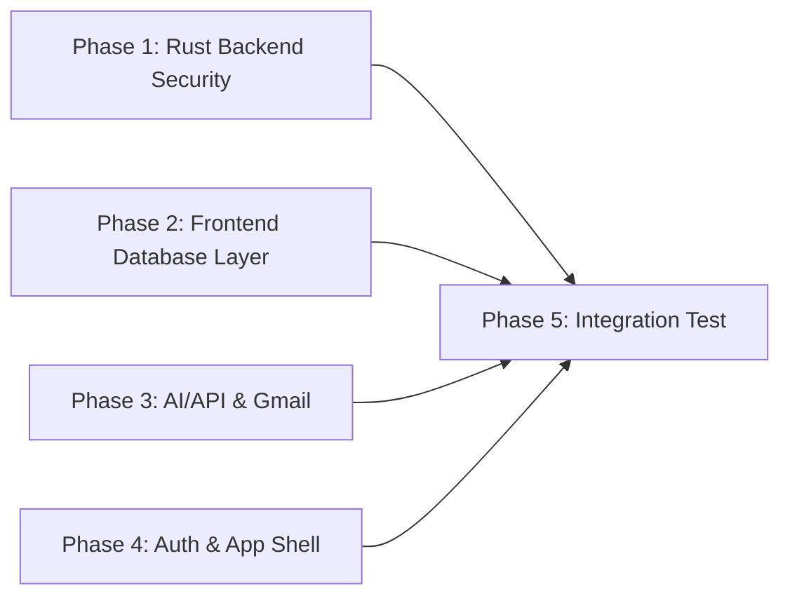

# Fix All Edge Cases — Parallel Implementation Plan

## Dependency Graph

## Execution Strategy

**Phases 1–4 run in PARALLEL** (no file overlap, independent concerns)  
**Phase 5 runs AFTER 1–4** (integration verification)

## Phase Overview

| Phase | Name | Status | Parallel Group | Effort | Files |
|-------|------|--------|----------------|--------|-------|
| 01 | [Rust Backend Security](./phase-01-rust-backend-security.md) | pending | A (parallel) | 1.5h | 5 Rust files |
| 02 | [Frontend Database Layer](./phase-02-frontend-database-layer.md) | pending | A (parallel) | 1.5h | 1 TS file |
| 03 | [AI/API & Gmail](./phase-03-ai-api-gmail.md) | pending | A (parallel) | 1.5h | 5 TS files |
| 04 | [Auth & App Shell](./phase-04-auth-app-shell.md) | pending | A (parallel) | 1h | 4 TS/TSX files |
| 05 | [Integration Verification](./phase-05-integration-verification.md) | pending | B (sequential) | 0.5h | test files only |

## File Ownership Matrix

| File | Phase |
|------|-------|
| `src-tauri/src/db/mod.rs` | Phase 1 |
| `src-tauri/src/db/connection.rs` | Phase 1 |
| `src-tauri/src/db/sqlite.rs` | Phase 1 |
| `src-tauri/src/db/postgres.rs` | Phase 1 |
| `src-tauri/src/db/mysql.rs` | Phase 1 |
| `src/lib/db.ts` | Phase 2 |
| `src/lib/ai.ts` | Phase 3 |
| `src/lib/ai-connections.ts` | Phase 3 |
| `src/lib/email-classifier.ts` | Phase 3 |
| `src/lib/gmail-poller.ts` | Phase 3 |
| `src/lib/tauri-fetch.ts` | Phase 3 |
| `src/lib/auth.tsx` | Phase 4 |
| `src/lib/token-storage.ts` | Phase 4 |
| `src/lib/crypto.ts` | Phase 4 |
| `src/App.tsx` | Phase 4 |
| `src/components/layout/app-error-boundary.tsx` | Phase 4 |
| `tests/*` | Phase 5 |

## Edge Cases by Phase

- **Phase 1** (8 fixes): SQL injection × 2, Mutex contention, stale connections, connection validation
- **Phase 2** (11 fixes): N+1 queries, transaction wrapping, race conditions, input validation, batch inserts
- **Phase 3** (10 fixes): Empty key guard, timeouts, rate limiting, streaming, response validation, silent failures
- **Phase 4** (7 fixes): Hardcoded passphrase, plaintext fallback, JSON parse safety, session race, login gate, error boundary, offline handling
- **Phase 5** (4 verifications): Build check, lint, unit tests, manual smoke test
